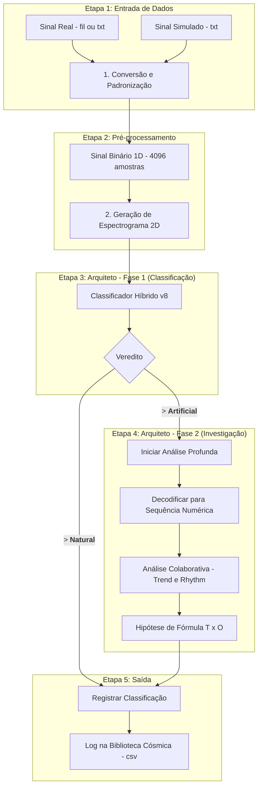

<div align="center">

<picture>
<source media="(prefers-color-scheme: dark)" srcset="https://github.com/JhonyJPHR/Projeto-Cygnus/blob/main/cygnus_banner_dark.png">
<source media="(prefers-color-scheme: light)" srcset="https://github.com/JhonyJPHR/Projeto-Cygnus/blob/main/cygnus_banner_light.png">

</picture>


# 🏛️ Projeto Cygnus v2: Arquiteto de Análise de Sinais

**Cygnus Decipher é um pipeline de Inteligência Artificial de múltiplos estágios projetado para classificar e analisar sinais de rádio complexos, com foco na distinção entre fenômenos naturais e potenciais tecnoassinaturas artificiais.**

Este projeto evoluiu de um analisador de sinais 1D para um sofisticado sistema 2D que utiliza Redes Neurais Convolucionais (CNNs), Redes Neurais Recorrentes (LSTMs) e Programação Genética (Regressão Simbólica) para fornecer uma análise profunda e em camadas de qualquer sinal de entrada.
</div>

---

## ✨ Principais Capacidades

- **Classificação Inteligente:** Utiliza um cérebro de IA híbrido (CNN-LSTM) treinado para reconhecer 6 classes de sinais (3 naturais, 3 artificiais), incluindo dados realistas com dispersão interestelar.
- **Análise em Duas Fases (Evolução 2):**
    1.  **Fase 1 (Classificação):** Determina a provável origem de um sinal (ex: `Pulsar`, `FRB`, `Artificial (Pi)`).
    2.  **Fase 2 (Investigação):** Se um sinal é classificado como artificial, um sistema de IAs especialistas é ativado para tentar decodificar a estrutura matemática subjacente, separando-a em **Tendência** e **Oscilação**.
- **Geração de Dados com GANs:** Utiliza Redes Adversariais Generativas (WGAN-GP) para aprender e gerar espectrogramas de sinais matemáticos complexos, criando um conjunto de dados de treinamento rico e diversificado.
- **Biblioteca Cósmica:** Registra automaticamente os resultados de cada análise em um arquivo `cosmic_library.csv`, construindo uma memória de longo prazo das descobertas do sistema.

---

## 🚀 Arquitetura do Sistema

O fluxo de trabalho do Cygnus é dividido em módulos claros e eficientes:


---

## 🛠️ Como Instalar e Executar

Este projeto foi desenvolvido e testado em um ambiente Windows com uma GPU NVIDIA.

### Pré-requisitos
- Python 3.10
- NVIDIA GPU com drivers atualizados
- CUDA Toolkit 11.2
- cuDNN v8.1

### Instalação

1.  **Clone o repositório:**
    ```bash
    git clone [https://github.com/JhonyJPHR/Projeto-CygnusV2.git](https://github.com/JhonyJPHR/Projeto-CygnusV2.git)
    cd Projeto-CygnusV2
    ```

2.  **Crie e ative o ambiente virtual:**
    ```bash
    py -3.10 -m venv venv_tf210
    .\venv_tf210\Scripts\activate
    ```

3.  **Instale as dependências:**
    ```bash
    pip install -r requirements.txt
    ```
    *(**Nota:** Certifique-se de ter o arquivo `requirements.txt` gerado com `pip freeze > requirements.txt`)*

### Executando uma Análise Completa

Para analisar um sinal, use o script do Arquiteto. Certifique-se de que os modelos `.keras` treinados estejam na pasta raiz.


# Exemplo analisando um sinal simulado de pulsar realista
```bash
python -m src.analysis.architect_analysis_2d data/sinal_realistic_pulsar_4096.txt
```

---

## 📊 Resultados Notáveis

- **Detecção de Estrutura:** O sistema demonstrou consistentemente a capacidade de distinguir sinais com estrutura matemática...
- **Generalização:** O modelo v8, treinado com dados realistas, superou os desafios...
- **Análise Profunda:** A Fase 2 conseguiu identificar corretamente a ausência...


Este projeto serve como uma poderosa prova de conceito para o uso de uma arquitetura de IA em camadas para a desafiadora tarefa de encontrar agulhas inteligentes em um palheiro cósmico.

<p align="center">
Desenvolvido com 🧠 e ☕ por <a href="https://github.com/JhonyJPHR">JhonyJPHR</a>
</p>


